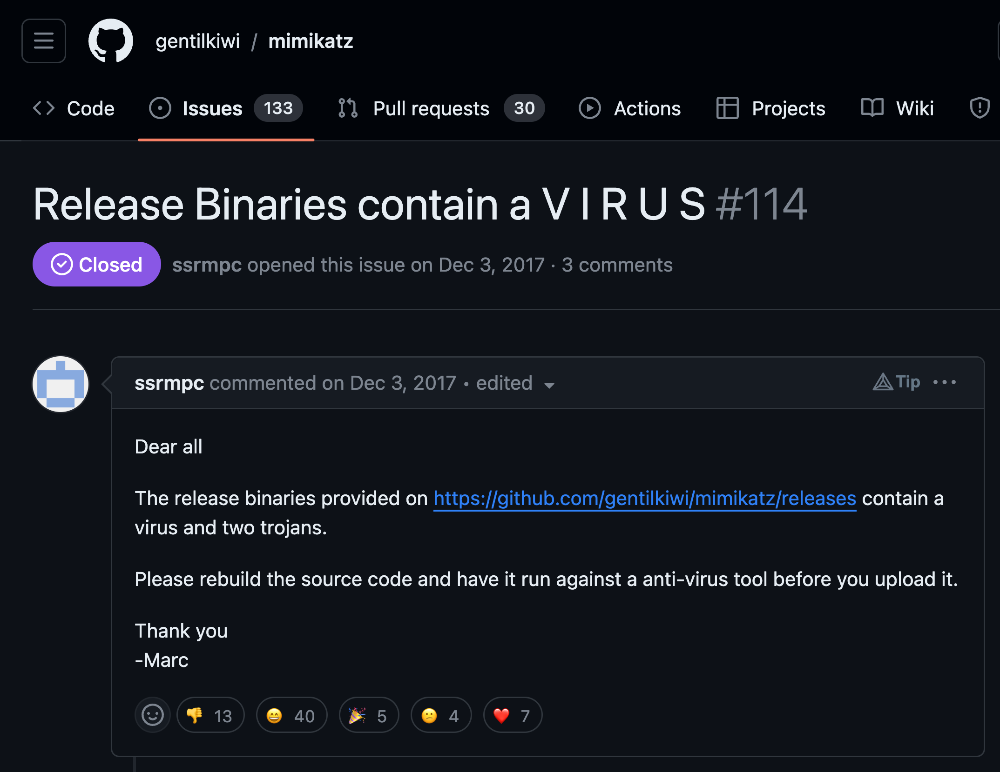
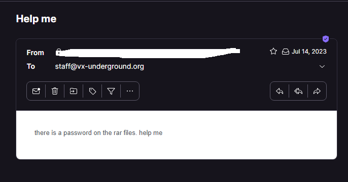

# LOLSecIssues

Cybersecurity's lighter side: a collection of the most amusing misunderstandings and missteps from newcomers to offensive security tools. A repository where naiveté in infosec is met with humor.

[Here] is the website to this repository.

---

## Quasar RAT

### AV Detection -> RAT in IT department

[Link to the issue](https://github.com/quasar/Quasar/issues/670)

### When download the binaries, my antivirus warns me

[Link to the issue](https://github.com/quasar/Quasar/issues/712)

### Does this have a Virus?

[Link to the issue](https://github.com/quasar/Quasar/issues/658)

---

## Mimikatz

### How should I run Mimikatz?

[Link to the issue](https://github.com/gentilkiwi/mimikatz/issues/78)

### Release Binaries Contain a Virus

[Link to the issue](https://github.com/gentilkiwi/mimikatz/issues/114)

---

## Web Shells

### Hidden Backdoor in Web Shell 1

[Link to the issue](https://github.com/tennc/webshell/issues/27)

### Hidden Backdoor in Web Shell 2

[Link to the issue](https://github.com/trustedsec/ptf/issues/303)

---

## SecLists

### Remove my password from lists so hackers won't be able to hack me

[Link to the issue](https://github.com/danielmiessler/SecLists/pull/155)

---

## Twitter

### VX Underground Password

[Link to the tweet](https://x.com/vxunderground/status/1689739200646578176?s=20)

---

## Historical

### Type in you password - it gets replaced with *

