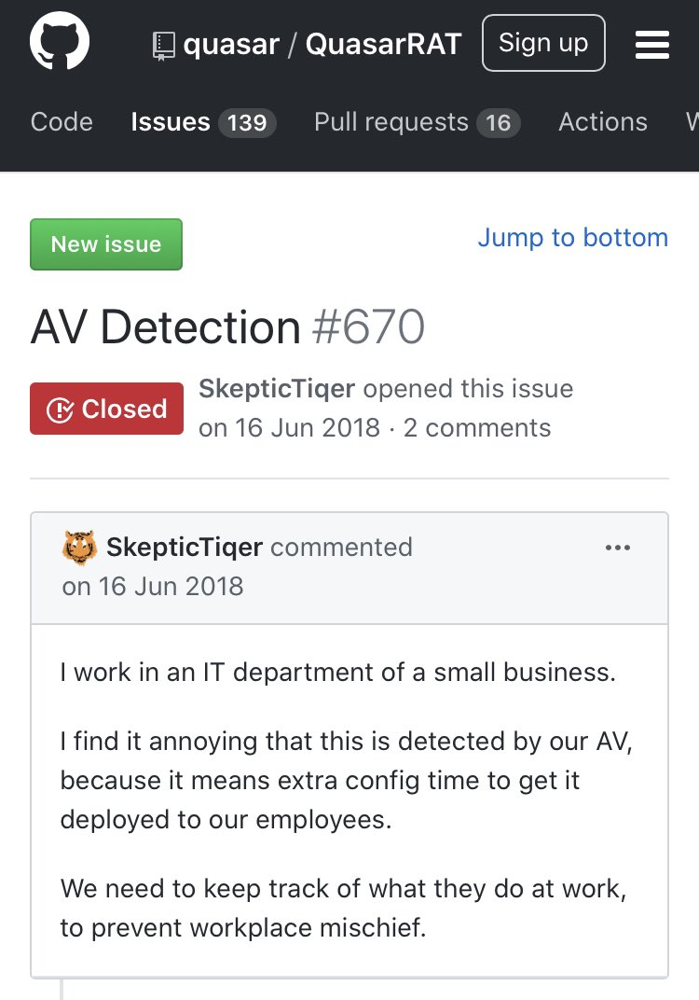
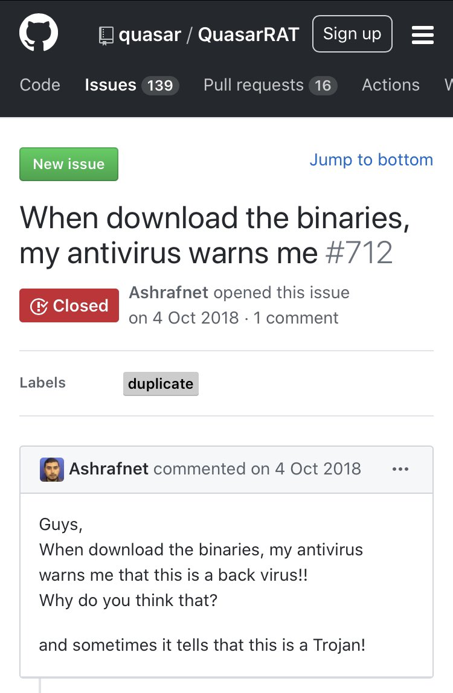
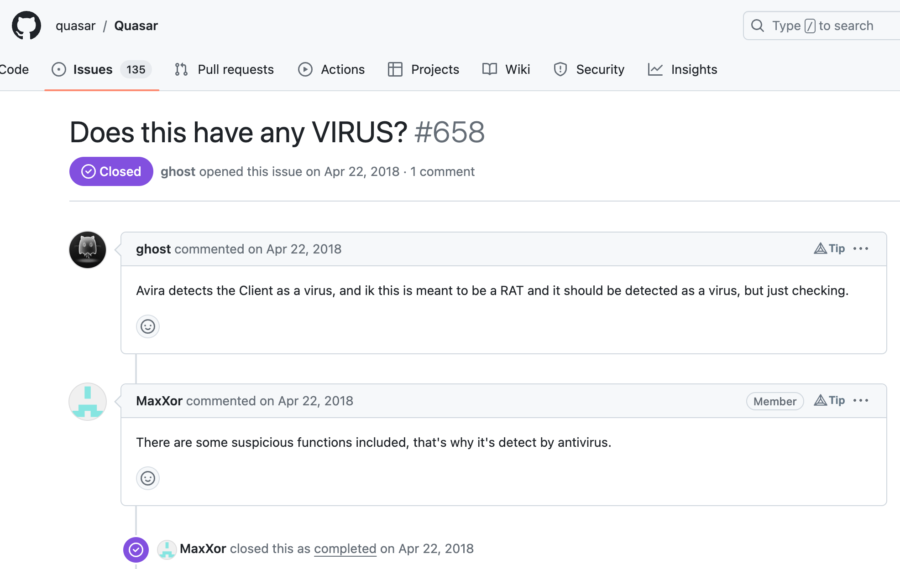
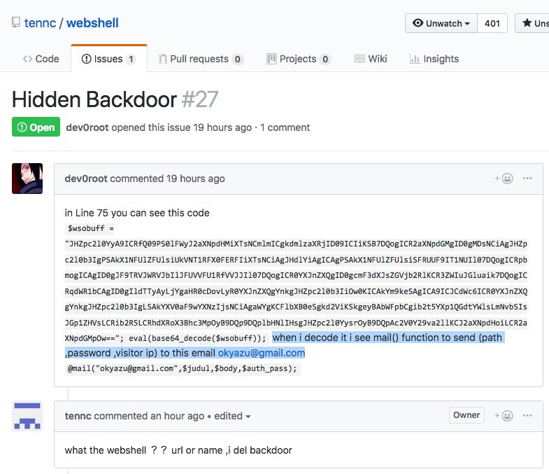
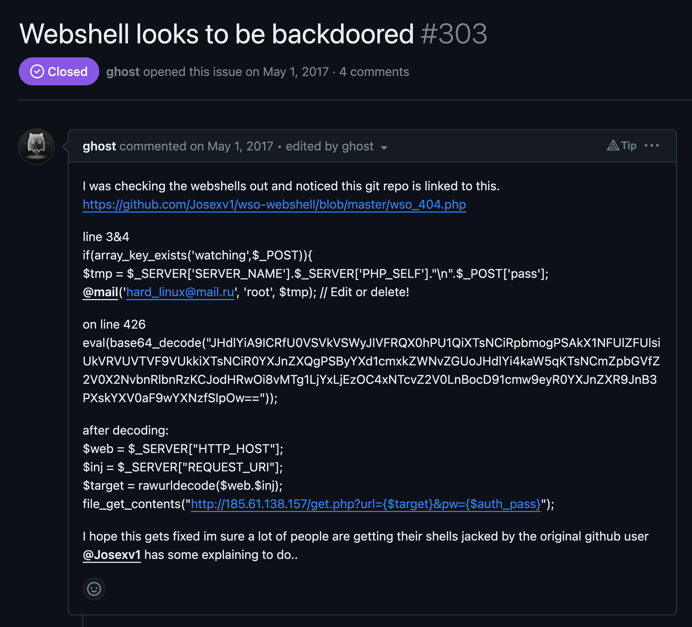
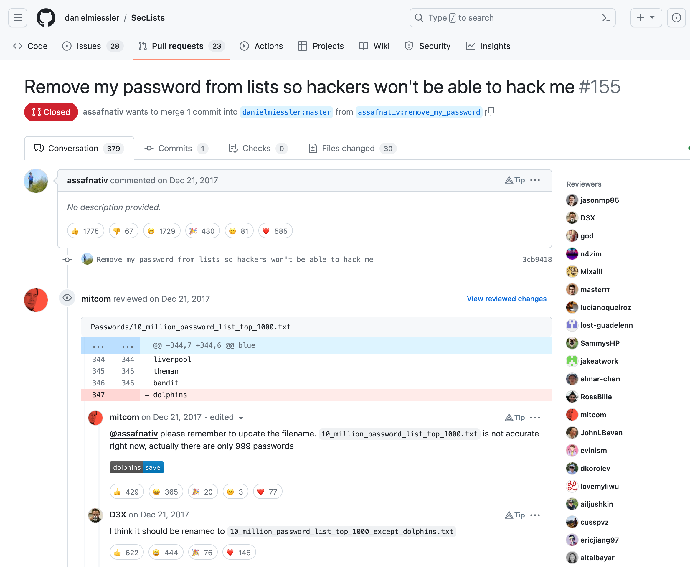
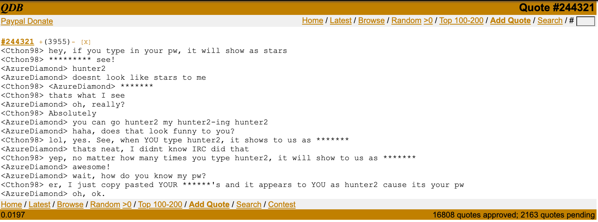

# LOLSecIssues

Cybersecurity's lighter side: a collection of the most amusing misunderstandings and missteps from newcomers to offensive security tools. A repository where naiveté in infosec is met with humor.

---

## Quasar RAT

### AV Detection -> RAT in IT department

[Link to Issue](https://github.com/quasar/Quasar/issues/670)

### When download the binaries, my antivirus warns me

[Link to Issue](https://github.com/quasar/Quasar/issues/712)

### Does this have a Virus?

[Link to Issue](https://github.com/quasar/Quasar/issues/658)

---

## Webshells

1. Hidden Backdoor in Webshell 1

[Link to Issue](https://github.com/tennc/webshell/issues/27)

2. Hidden Backdoor in Webshell 2

[Link to Issue](https://github.com/trustedsec/ptf/issues/303)

---

## SecLists

1. Remove my password from lists so hackers won't be able to hack me

[Link to Issue](https://github.com/danielmiessler/SecLists/pull/155)

--- 

## Historical

1. Type in you password - it gets replaced with *

